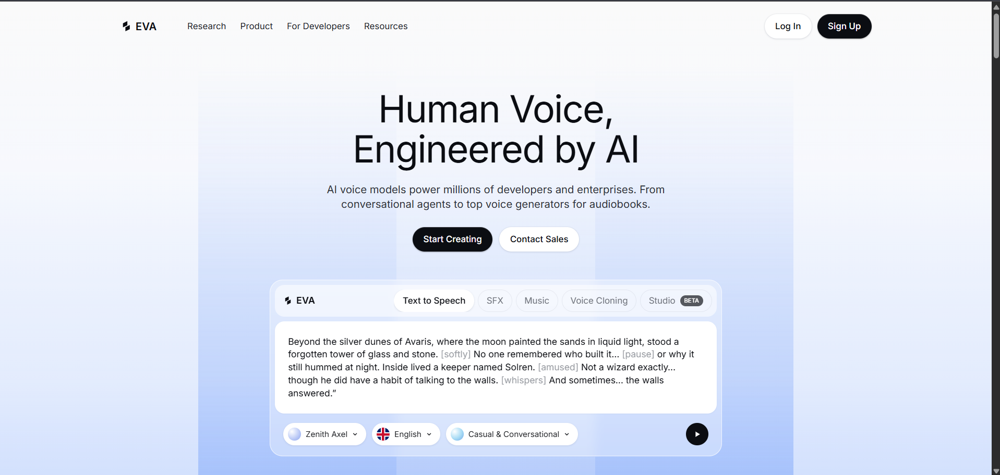
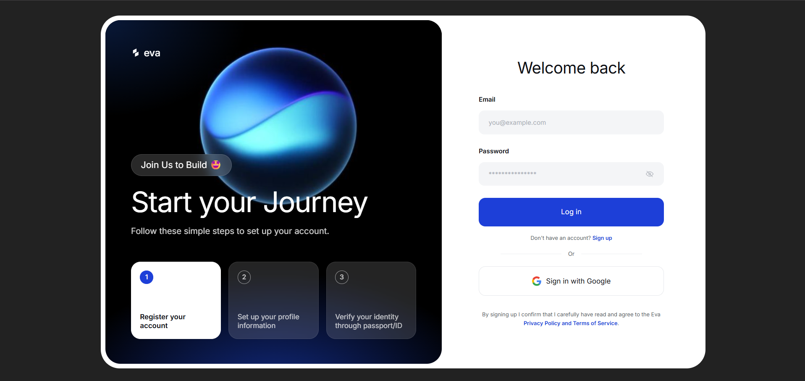
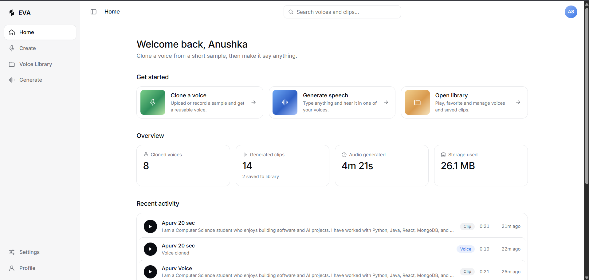
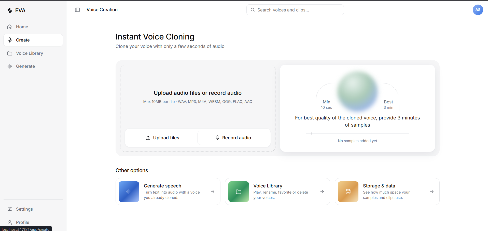
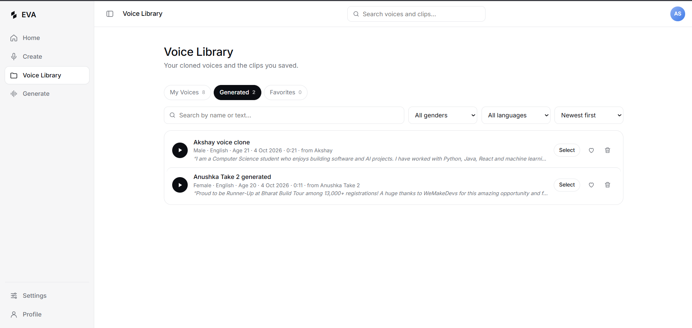
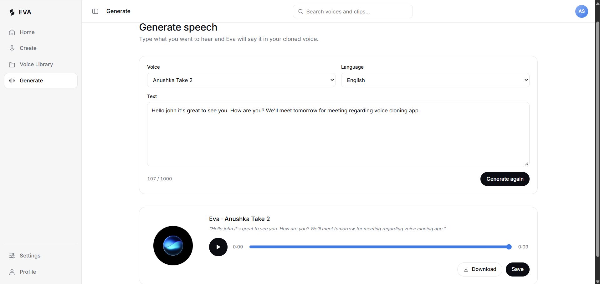

# Eva — AI Voice Cloning Studio

Eva is a self-hosted voice cloning web app. Record or upload a short sample of a voice, and Eva clones it instantly using zero-shot voice cloning, then lets you generate natural speech in that voice from any text. Voices and generated clips are saved to a personal library you can play, favorite, and manage.

> ⚠️ **Responsible use:** Only clone voices you own or have explicit permission to use. Eva asks for consent before every new voice is created.

---

## ✨ Features

- **Instant voice cloning** — Clone a voice from as little as 10 seconds of audio (around 3 minutes gives the best quality). No per-speaker training required.
- **Record or upload** — Record directly in the browser with a guided reading paragraph, live timer and level meter, or upload existing audio files (up to 10MB each).
- **Text-to-speech generation** — Pick a voice, type your text, and generate speech. Results play back through an animated Eva assistant that "speaks" while the audio plays.
- **Voice library** — Browse *My Voices*, *Generated*, and *Favorites*, with play, select, favorite, and delete actions, plus search, filters, and sorting.
- **Rich voice metadata** — Save generated voices with name, gender, language, and age.
- **Dashboard home** — Quick-start actions, usage metrics, and recent activity at a glance.
- **Settings** — See storage and data usage, and permanently delete all voices, generated audio, and history in one action.
- **Secure accounts** — Sign-up, sign-in, and profile management powered by Clerk; every user's data is private to them.
- **Fully responsive** — Works on desktop, tablet, and mobile.

---

## 🧱 Tech Stack

| Layer | Technology |
| --- | --- |
| Frontend | React |
| Authentication | Clerk |
| Backend API | FastAPI (Python) |
| Voice model | XTTS-v2 (Coqui) |
| ML runtime | PyTorch (CUDA GPU) |
| Database | MongoDB Atlas |
| Audio storage | Local disk (reference clips, speaker embeddings, generated audio) |

---

## 🏗️ How It Works

1. **Create a voice** — The browser records or uploads a reference clip. The backend resamples it to 24kHz mono, trims silence, normalizes loudness, and rejects clips that are too short or too noisy.
2. **Cache the speaker embedding** — XTTS-v2's speaker encoder runs once per voice, and the embedding is cached so later generations never re-process the raw audio.
3. **Generate speech** — The frontend sends text and a voice ID; the backend runs XTTS-v2 on the GPU using the cached embedding, saves the output, and returns it for playback.
4. **Store and manage** — Voice and generation metadata live in MongoDB Atlas, scoped to the signed-in Clerk user. Audio files and embeddings are stored on disk.

The XTTS-v2 model is loaded once when the server starts and stays resident on the GPU, so requests don't pay the model-loading cost.

---

## 📋 Prerequisites

- Python 3.10+
- Node.js 18+
- NVIDIA GPU with CUDA (8GB+ VRAM recommended)
- A [MongoDB Atlas](https://www.mongodb.com/atlas) cluster
- A [Clerk](https://clerk.com) application

---

## 🚀 Getting Started

### 1. Clone the repository

```bash
git clone https://github.com/<your-username>/eva.git
cd eva
```

### 2. Set up the backend

```bash
cd backend
python -m venv venv
source venv/bin/activate        # Windows: venv\Scripts\activate
pip install -r requirements.txt
```

The XTTS-v2 model weights download automatically on first run.

### 3. Set up the frontend

```bash
cd frontend
npm install
```

### 4. Configure environment variables

Create a `.env` file in each folder (see the table below).

### 5. Run the app

```bash
# Backend (from /backend)
uvicorn app.main:app --reload --host 127.0.0.1 --port 8000

# Frontend (from /frontend)
npm run dev
```

Open the frontend URL shown in your terminal and sign in with Clerk.

---

## 🔐 Environment Variables

**Backend (`backend/.env`)**

| Variable | Description |
| --- | --- |
| `MONGODB_URI` | MongoDB Atlas connection string |
| `MONGODB_DB_NAME` | Database name |
| `CLERK_SECRET_KEY` | Clerk secret key for verifying sessions |
| `CLERK_JWKS_URL` | Clerk JWKS endpoint for token verification |
| `STORAGE_DIR` | Folder for reference clips, embeddings, and generated audio |
| `FRONTEND_URL` | Allowed CORS origin |

**Frontend (`frontend/.env`)**

| Variable | Description |
| --- | --- |
| `VITE_CLERK_PUBLISHABLE_KEY` | Clerk publishable key |
| `VITE_API_URL` | Backend base URL |

> Never commit `.env` files. Rename variables to match your project if they differ.

---

## 🔌 API Overview

All endpoints require a valid Clerk session token.

| Endpoint | Method | Description |
| --- | --- | --- |
| `/voices` | POST | Upload or record a reference clip and create a cloned voice |
| `/voices` | GET | List the current user's voices |
| `/voices/{id}` | DELETE | Delete a voice and its cached embedding |
| `/generate` | POST | Generate speech from text using a selected voice |
| `/audio/{id}` | GET | Stream a reference or generated audio file |
| `/user/usage` | GET | Storage and data usage for the current user |
| `/user/data` | DELETE | Permanently delete all of the user's voices, audio, and history |

Interactive API docs are available at `/docs` once the backend is running.

---

## 🗺️ Roadmap

- [x] Zero-shot voice cloning with XTTS-v2
- [x] In-browser recording and file upload
- [x] Voice library with favorites
- [x] Clerk authentication and MongoDB Atlas storage
- [ ] Streaming generation for lower latency
- [ ] Job queue for concurrent users
- [ ] Cloud object storage for audio files

---

## ⚠️ Limitations

- Generation speed depends on your GPU; very long text increases latency and memory use.
- Clone quality depends heavily on the reference audio — background noise and poor microphones reduce fidelity.

---

## 📄 License & Model Terms

This project's code is released under the license in [`LICENSE`](LICENSE).

XTTS-v2 is distributed under the **Coqui Public Model License (CPML)**, which restricts commercial use. Eva is intended for personal, educational, and research use. Review the CPML before any commercial deployment.

---

## 🙏 Acknowledgements

- [Coqui TTS / XTTS-v2](https://github.com/coqui-ai/TTS)
- [Clerk](https://clerk.com)
- [MongoDB Atlas](https://www.mongodb.com/atlas)
- [FastAPI](https://fastapi.tiangolo.com)

---

## Screenshots

### Home



### Login



### Dashboard








